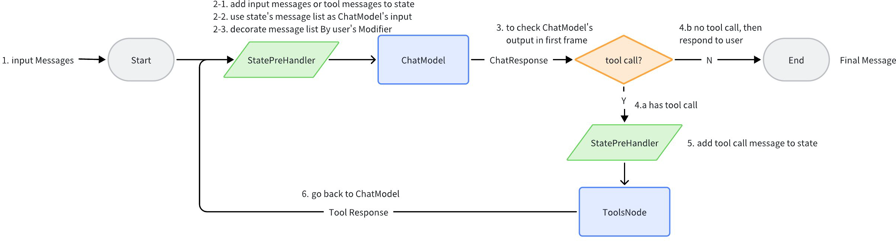

## code explore agent

### callbacks
https://www.cloudwego.io/zh/docs/eino/core_modules/chain_and_graph_orchestration/callback_manual/

### tools
https://www.cloudwego.io/zh/docs/eino/core_modules/components/tools_node_guide/how_to_create_a_tool/

### 编排
https://www.cloudwego.io/zh/docs/eino/core_modules/chain_and_graph_orchestration/chain_graph_introduction/

### call option
https://www.cloudwego.io/zh/docs/eino/core_modules/chain_and_graph_orchestration/call_option_capabilities/